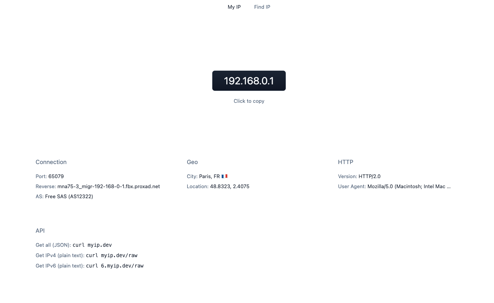

    
   
  Minimalist IP and connection information tool

---

- [Features](#features)
- [Usage](#usage)
- [License](#license)

## Features

- **Minimalist**: intentionally small & clutter-free
- **API**: `curl` to get JSON/plain text

## Usage

- Web interface: [https://myip.dev](https://myip.dev)
- Get all (JSON): `curl myip.dev`
- Get IPv4 (plain text): `curl myip.dev/raw`
- Get IPv6 (plain text): `curl 6.myip.dev/raw`

## License

[MIT](./LICENSE)

